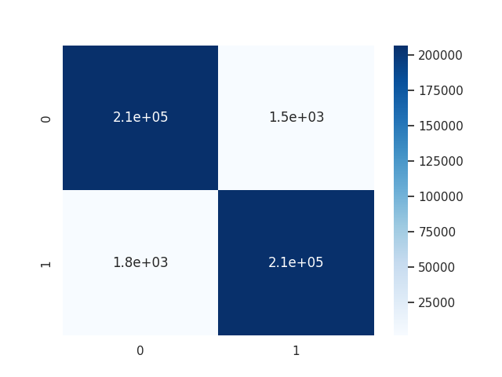

# Random Forest# Random Forest Model for Credit Card Fraud Detection

## Overview

This repository contains code for training a Random Forest model on the credit card fraud training dataset. The goal is to create a classification model that can identify whether a credit card transaction is fraudulent or not.

## Dataset

The dataset used for training is obtained from the "tanzuhuggingface/creditcardfraudtraining" dataset. It includes features such as time_elapsed, long, lat, and amt, and a binary target variable 'is_fraud'.

## Setup

1. Clone the repository:

   ```bash
   git clone https://github.com/2bdulra7manRea/ml-random-forest-credit-card-fraud-detection.git
   cd ml-random-forest-credit-card-fraud-detection
   ```

2. Install the required dependencies:

   ```bash
   pip install -r requirements.txt
   ```

## Data Splitting and Preprocessing

The dataset is split into training and testing sets to evaluate the model's performance. The following features are selected: 'time_elapsed', 'long', 'lat', and 'amt'. These features are then used to train the Random Forest model.

## Training

To train the Random Forest model, run the following command:

```bash
python train_model.py
```

## Evaluation

After training, the model is evaluated on the test set, and accuracy is calculated. Additionally, a classification report and confusion matrix are generated to assess the model's performance.


## Confusion Matrix

Here is the confusion matrix for the model:




## License

This project is licensed under the [MIT License](LICENSE).